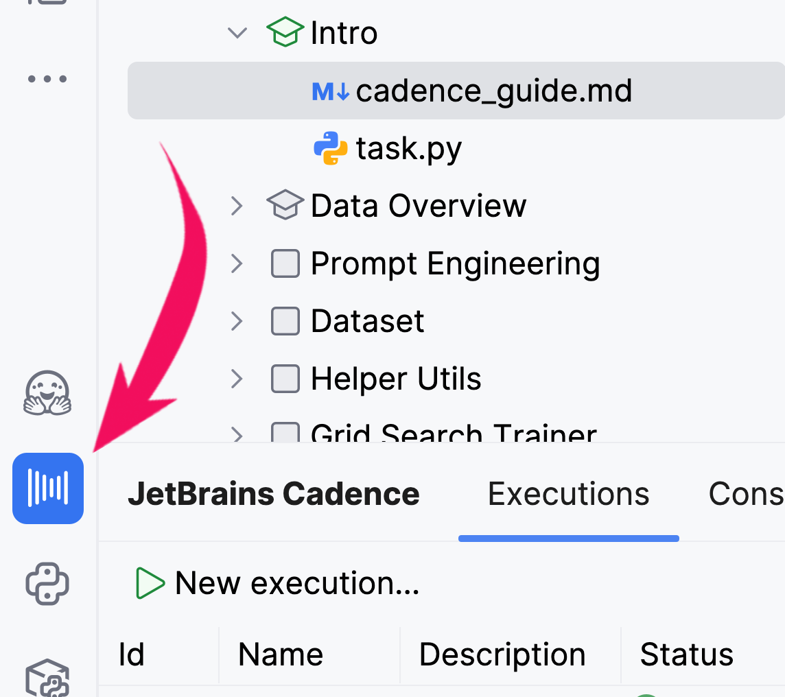
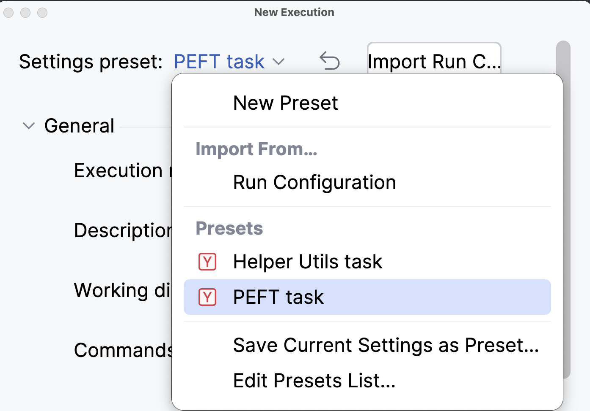
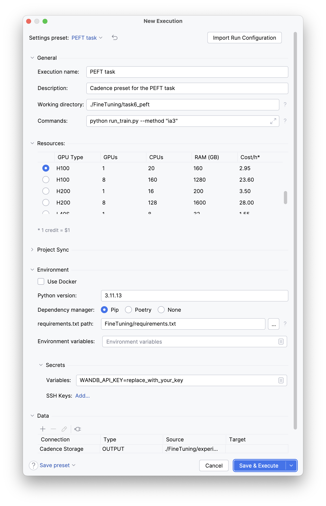
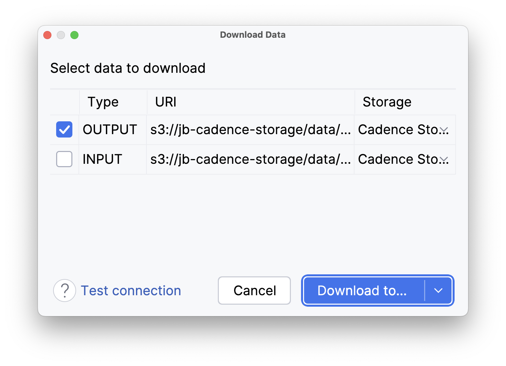

# JetBrains Cadence: A guide to cloud GPUs

## What is JetBrains Cadence?

[JetBrains Cadence](https://plugins.jetbrains.com/plugin/23731-jetbrains-cadence) is a PyCharm plugin that lets you run
Python machine learning code on powerful cloud hardware, directly from your IDE. It requires no complex cloud setup or expertise, making it perfect for students who want to focus on learning ML concepts rather than infrastructure management.

## Installation
1. Open PyCharm
2. Go to **File** → **Settings** → **Plugins**
3. Search for "JetBrains Cadence"
4. Install the plugin and restart PyCharm


## Workflow
Working with Cadence involves the following steps:
1. **Configuration**: Specify what you want to run, what environment variables to use, what resources you need, and which data to download afterward.
2. **Run**: Execute your solution.
3. **Download**: Get the required artifacts.

## Getting started
First, open the Cadence tool window:
<div style="text-align: center; max-width: 350px; margin: 0 auto;">

</div>

Then, click on the  **New execution...** button.

### Prepared presets
This guide will show you how to set up a code run in Cadence. 
To make the process easier, we have saved the run settings as presets.
Choosing a preset will pre-fill the required settings, saving you from entering them manually.

<div style="text-align: center; max-width: 350px; margin: 0 auto;">

</div>

### Manual configuration
1. Enter an execution name that is clear to you.
2. Enter the path to the working directory, starting from the course root. For the [Helper Utils](../task4_helpers/task.md) task, it should be `./FineTuning/task4_helpers/`, and for the [PEFT](../task6_peft/task.md) task, it should be `./FineTuning/task6_peft/`.
3. Type the commands to execute:
    ```shell
      python run.py
    ```
    for the Helper Utils task, or, for example,
    ```shell
      python run_train.py --method "ia3"
    ```
    for the PEFT task.

4. Check the `requirements.txt` file path. For this lesson, use the `FineTuning/requirements.txt` file.
5. For the `PEFT` you need to add your API key from WandDB to the environment variable `WANDB_API_KEY` for authorization.
6. Add any data output you need to download after execution. For the `PEFT` task, you can add the entire `./FineTuning/experiments/` directory.

<div style="text-align: center; max-width: 600px; margin: 0 auto;">

</div>

### Running your code
Finally, launch your code on the cloud hardware with the `Execute` button.

### Downloading data back
After the execution is complete, you can download the required artifacts.
Click the  button on the right side of the Cadence tool window. In the dialog that opens, select the output you need and click the `Download to...` button.

<div style="text-align: center; max-width: 350px; margin: 0 auto;">

</div>

 For the `PEFT` task, download the results to the `./FineTuning/experiments/` directory within the course folder.

## Key features

### Data management
- **Local File Upload**: Cadence [automatically uploads](https://plugins.jetbrains.com/plugin/23731-jetbrains-cadence/docs/manage-data.html) your project files.
- **Result Download**: Easily download your training results and model outputs.
- **Version Control**: Keep track of different experiment runs.

### Execution monitoring
- **Real-time Logs**: Monitor your training progress directly in PyCharm.
- **Execution History**: View parameters and results [from previous runs](https://plugins.jetbrains.com/plugin/23731-jetbrains-cadence/docs/executions.html).
- **Resource Management**: See what cloud resources are being used.

## Getting help
Check the [official documentation](https://plugins.jetbrains.com/plugin/23731-jetbrains-cadence/docs).

<style>
img {
  display: inline !important;
}
</style>
