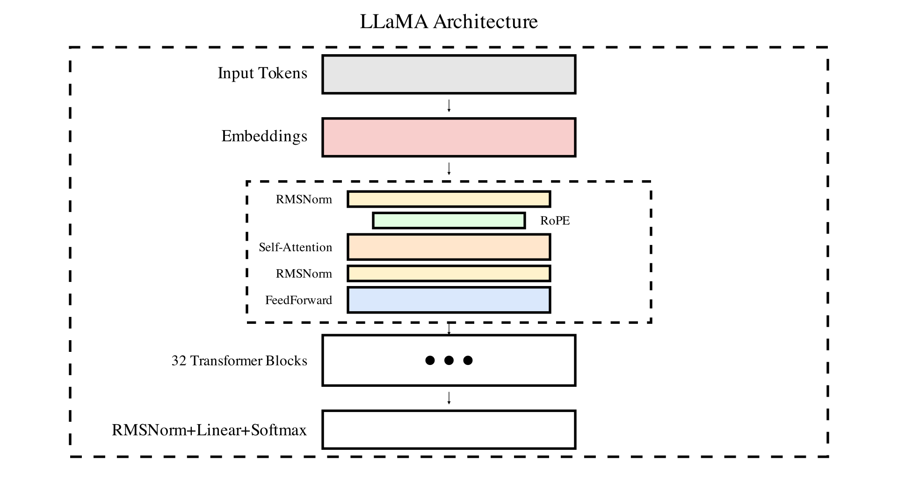

### Learning objectives

By completing this task, you will be able to:
- **Understand Llama architecture** - Learn the key components of the Llama transformer model, including RMSNorm, attention mechanisms, and layer structure.
- **Implement normalization techniques** - Build the RMSNorm layer that provides stability during training without the bias term used in LayerNorm.
- **Build attention mechanisms** - Implement the core attention computation that allows the model to focus on relevant parts of the input sequence.
- **Construct transformer layers** - Assemble individual components into complete transformer layers that can be stacked to form the full model.

### Problem context

The Llama (Large Language Model Meta AI) family represents state-of-the-art transformer architectures optimized for efficient training and inference. Understanding and implementing its core components is essential for anyone working with modern language models.

**Why this implementation matters:**
- Provides hands-on experience with cutting-edge transformer architecture.
- Builds understanding of how normalization, attention, and feed-forward layers work together.
- Demonstrates the architectural choices that make Llama efficient and effective.

**What makes this challenging:**
- Attention mechanisms involve complex matrix operations and require careful attention to dimensions.
- RMSNorm differs from standard LayerNorm in subtle but important ways.
- Component integration requires understanding how data flows through the transformer stack.

## Implementation requirements

Implement the core components of the Llama transformer architecture. You'll build the essential building blocks that make up this powerful language model, focusing on three critical components.

### Specific requirements:

1. **RMSNorm implementation** - Complete the `RMSNorm._norm` method to implement Root Mean Square normalization
2. **Attention mechanism** - Implement `Attention.compute_query_key_value_scores` for the attention computation
3. **Layer integration** - Complete `LlamaLayer.forward` to combine all components into a working transformer layer

### Expected deliverables:
- Working RMSNorm that properly normalizes activations using the RMS formula.
- Functioning attention mechanism that computes query-key-value interactions correctly.
- Complete Llama layer that processes input through attention and feed-forward components.

### Implementation guidelines:

Components that require your implementations are marked with `#todo`. Detailed instructions are provided in the corresponding code blocks.

**Important**: You are free to reorganize functions within each class, but please don't rename variables corresponding to Llama2 parameters. Renaming these variables will prevent the model from loading pre-trained weights.

**Tip**: RMSNorm differs from LayerNorm by using root mean square instead of mean and standard deviation. Focus on computing the RMS of the input activations and scaling appropriately.

