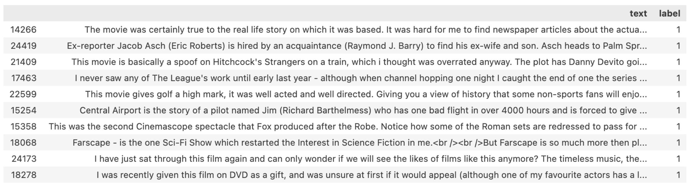
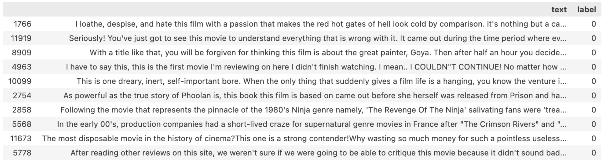

### Learning Objectives

By completing this task, you will be able to:
- **Perform exploratory data analysis (EDA)** on text datasets using Pandas to understand data characteristics
- **Assess data quality** by identifying duplicates, outliers, and class imbalance issues
- **Calculate descriptive statistics** for text data including length distributions and class balance
- **Apply data preprocessing techniques** to clean datasets before model training
- **Visualize data patterns** to gain insights into the structure and characteristics of text data

### Problem Context

Before building any machine learning model, understanding your data is crucial. In NLP tasks, this means examining not just the numerical properties (like text length and class distribution) but also identifying potential data quality issues that could impact model performance.

**Why data exploration matters:**
- Class imbalance can lead to biased models that perform poorly on minority classes
- Duplicate entries can inflate performance metrics and lead to overfitting
- Outliers (very short or very long texts) may need special handling
- Understanding text length distributions helps inform preprocessing decisions

**What makes this challenging:**
- Text data requires different analysis techniques than numerical data
- Identifying meaningful outliers in text length requires domain knowledge
- Balancing data cleaning with preserving authentic language patterns

In this task, you'll use the **Pandas** library to perform systematic data exploration and quality assessment.

### Data

__Data:__ the data is a set of 25,000 reviews from IMDB, labeled by sentiment (positive/negative).

__Review examples:__ \
Positive


Negative



## Implementation Requirements

Implement two classes that provide essential data exploration and preprocessing capabilities:

### Specific Requirements:

**1. `Statistics` class - Data Analysis Methods:**
- `get_lens(text_series)` - Calculate character length for each text entry
- `get_balance(label_series)` - Count occurrences of each class label  
- `get_quantile(series, p)` - Calculate the p-th quantile of a numerical series
- `get_shape(dataframe)` - Return dimensions of the dataset

**2. `DataProcessor` class - Data Cleaning Methods:**
- `remove_duplicates(dataframe)` - Remove duplicate entries while preserving data integrity
- `remove_outliers(series)` - Identify and remove statistical outliers from numerical data

### Expected Deliverables:
- Completed `Statistics` class with all statistical analysis methods
- Completed `DataProcessor` class with data cleaning functionality
- Methods should handle edge cases gracefully (empty data, all duplicates, etc.)
- All methods should maintain data type consistency with pandas conventions

### Examples

```python
>>> import Statistics as st
>>> import DataProcessor as dp
>>> data = pd.DataFrame({'text': ['I like this movie', 'I hate it', 'I like this movie'], \
                            'label': [1, 0, 1]})
>>> st.get_shape(data)
(3, 2)
>>> lens = st.get_lens(data['text'])
>>> lens
[17, 9, 17]
>>> st.get_balance(data['label'])
1    2
0    1
Name: count, dtype: int64
>>> st.get_quantile(pd.Series(lens), 0.25)
13.0
>>> dp.remove_duplicates(data)
              text  label
0  I like this movie      1
1          I hate it      0
>>> dp.remove_outliers(pd.Series(lens))
[17, 9, 17]
```

## Notes

1. The dataset is downloaded from the Hugging Face library. You can read more about it [here](https://huggingface.co/datasets/imdb).
2. **Data visualization skills**: For comprehensive data visualization training, check out the [Data Visualization in Python course](https://plugins.jetbrains.com/plugin/27941-data-visualization-in-python) by JetBrains Academy.
3. **Pandas fundamentals**: If you're new to Pandas, the [Gateway to Pandas course](https://plugins.jetbrains.com/plugin/22686-gateway-to-pandas) by JetBrains Academy provides excellent hands-on training.
4. Additional resources: [Pandas official documentation](https://pandas.pydata.org/docs/) and [matplotlib](https://matplotlib.org/)/[seaborn](https://seaborn.pydata.org/) for visualization libraries.

<div class="hint" title="Outlier Detection Strategy">

**Tip**: For `remove_outliers`, consider using the Interquartile Range (IQR) method: outliers are typically defined as values below Q1 - 1.5×IQR or above Q3 + 1.5×IQR. The `pandas.Series.quantile()` method will be helpful for calculating Q1 and Q3.

</div>

<div class="hint" title="Handling Duplicates">

**Tip**: When removing duplicates, consider whether you want to keep the first occurrence, last occurrence, or remove all duplicates entirely. The `pandas.DataFrame.drop_duplicates()` method has parameters to control this behavior.

</div>
