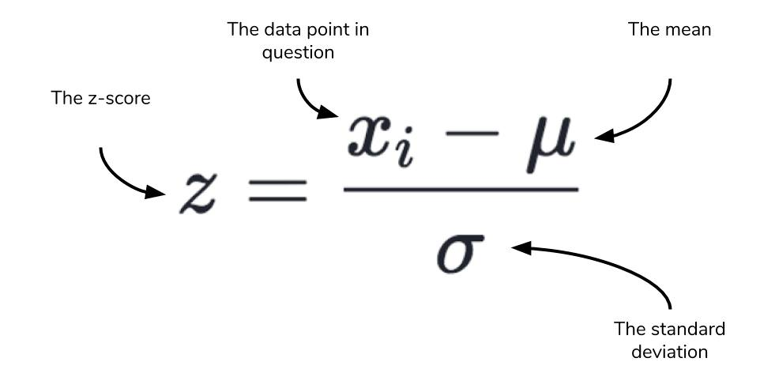

### Learning Objectives

By completing this task, you will be able to:
- **Understand dimensionality reduction** - Learn why high-dimensional embeddings need to be reduced for visualization
- **Apply t-SNE technique** - Use t-distributed Stochastic Neighbor Embedding to preserve local neighborhood relationships
- **Implement data normalization** - Apply z-score normalization to improve visual interpretability of reduced embeddings
- **Visualize semantic relationships** - Create 2D plots that reveal clustering and relationships between words
- **Compare dimensionality reduction methods** - Understand the trade-offs between PCA, t-SNE, and other reduction techniques

### Problem Context

**Dimensionality reduction** is crucial for understanding and interpreting high-dimensional embedding spaces. While word embeddings capture rich semantic relationships, their typical 100-300 dimensions make direct visualization impossible.

**Why visualization matters:**
- **Intuitive understanding**: Visual patterns reveal semantic clusters and relationships that are hidden in raw numbers
- **Model debugging**: Visualization helps identify issues with embeddings (e.g., words that should be similar but aren't)
- **Quality assessment**: Good embeddings show clear semantic groupings when visualized
- **Communication**: Visual representations make NLP results interpretable to non-technical stakeholders

**The dimensionality challenge:**
- Word embeddings typically have 100-300 dimensions, but humans can only perceive 2-3 dimensions visually
- Simple projections (like selecting two dimensions) lose most of the semantic information
- **t-SNE (t-distributed Stochastic Neighbor Embedding)** preserves local neighborhood structure while reducing dimensions
- Unlike PCA, t-SNE is non-linear and better at revealing cluster structures

**Technical considerations:**
- t-SNE focuses on preserving local similarities rather than global structure
- Z-score normalization after reduction centers the visualization and standardizes the scale
- Different perplexity parameters in t-SNE can reveal different levels of clustering
- The visualization quality depends on the original embedding quality

We'll use **Bokeh** for interactive visualization, allowing you to explore the embedding space dynamically.

## Implementation Requirements

Create a robust `EmbeddingReducer` class that transforms high-dimensional embeddings into interpretable 2D visualizations.

### Specific Requirements:

**1. Dimensionality Reduction Method:**
- `reduce(word_vectors)` - Complete pipeline for embedding visualization
  - Apply t-SNE to reduce from N dimensions to 2 dimensions
  - Use appropriate t-SNE parameters (perplexity, iterations, learning rate)
  - Handle edge cases (insufficient data points, identical vectors)
  - Return 2D numpy array suitable for plotting

**2. Post-Processing Normalization:**
- Apply z-score normalization to the t-SNE output:
  - Subtract the mean from each dimension: `(x - μ) / σ`
  - Divide by standard deviation to achieve unit variance
  - Center the visualization around origin (0, 0)
  - Ensure comparable scales across both dimensions

**3. Quality Considerations:**
- Preserve relative distances and neighborhood relationships from original space
- Handle numerical stability issues (division by zero, very small standard deviations)
- Maintain consistent output format regardless of input size
- Optimize for visual interpretability of semantic clusters

### Expected Deliverables:
- Completed `EmbeddingReducer` class with robust error handling
- 2D embeddings with zero mean and unit variance after normalization
- Consistent output format suitable for interactive visualization with Bokeh
- Proper handling of edge cases and numerical stability

**Z-score normalization formula:**


### Examples

```python
>>> from your_code import EmbeddingReducer as er
>>> word_vectors = np.random.rand(100, 300)  # Example 100 word vectors with 300 dimensions
>>> reducer = er()
>>> reduced_vectors = reducer.reduce(word_vectors)
>>> reduced_vectors.shape
(100, 2)
>>> reduced_vectors.mean(axis=0)
array([0., 0.])  # Approximately zero mean after normalization
>>> reduced_vectors.std(axis=0)
array([1., 1.])  # Approximately unit variance after normalization
```


## Notes

1. **Bokeh visualization**: We use the Bokeh library for interactive embedding visualization. It provides excellent tools for exploring high-dimensional data patterns.

2. **t-SNE parameters**: Default parameters usually work well, but you may experiment with different perplexity values (5-50) depending on your dataset size.

3. **Computational complexity**: t-SNE can be slow for large datasets. Consider sampling if you have more than 10,000 vectors.

4. **Interpretation guidelines**: 
   - Clusters indicate semantic similarity
   - Distances within clusters are meaningful, but distances between distant clusters may not be
   - Multiple runs may produce slightly different layouts

<div class="hint" title="t-SNE Implementation">

**Tip**: Use `sklearn.manifold.TSNE` with `n_components=2`. Set `random_state` for reproducible results. Consider adjusting `perplexity` based on your dataset size (typically 5-50).

</div>

<div class="hint" title="Z-score Normalization">

**Tip**: After t-SNE, compute mean and standard deviation for each dimension separately using `np.mean(axis=0)` and `np.std(axis=0)`. Handle the case where standard deviation might be zero.

</div>

<div class="hint" title="Handling Edge Cases">

**Tip**: Check for edge cases like identical vectors or insufficient data points. t-SNE requires at least 3 data points and works best with perplexity < n_samples/3.

</div>

<div class="hint" title="Numerical Stability">

**Tip**: When dividing by standard deviation, add a small epsilon (e.g., 1e-8) to avoid division by zero: `(x - mean) / (std + epsilon)`.

</div>